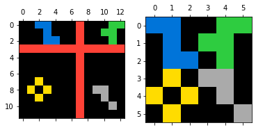
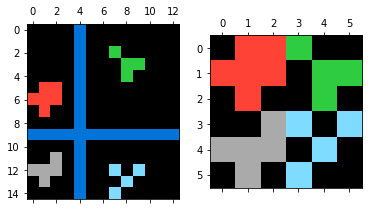
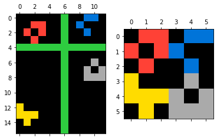
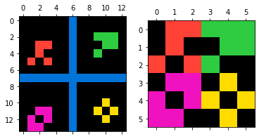
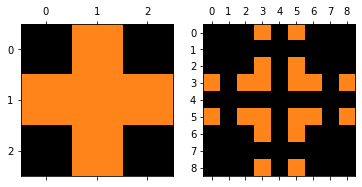
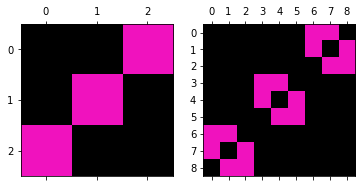
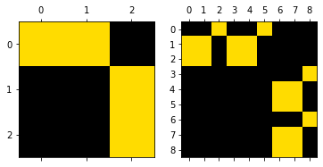
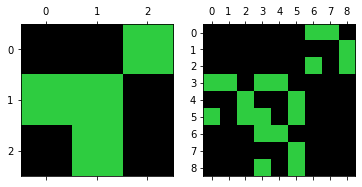

### Project Title
# The Abstraction and Reasoning Corpus (ARC) (May 2020)

*"ARC can be seen as a general artificial intelligence benchmark, as a program synthesis benchmark, or as a psychometric intelligence test. It is targeted at both humans and artificially intelligent systems that aim at emulating a human-like form of general fluid intelligence."*

A complete description of the dataset, its goals, and its underlying logic, can be found in: [Abstraction and Reasoning Challenge](https://www.kaggle.com/c/abstraction-and-reasoning-challenge).

As a reminder, a test-taker is said to solve a task when, upon seeing the task for the first time, they are able to produce the correct output grid for *all* test inputs in the task (this includes picking the dimensions of the output grid). For each test input, the test-taker is allowed 3 trials (this holds for all test-takers, either humans or AI).

## Project structure
├── data\
│   ├── evaluation\
│   ├── test\
│   ├── training\
│   ├── sample_submission.csv\
├── images\
├── model\
│   ├──model.h5\
├── main.ipynb\
├── submissions\
├── requirements.txt\
└── License

## Task file format

The `data` directory contains two subdirectories:

- `data/training`: contains the task files for training (400 tasks). Use these to prototype your algorithm or to train your algorithm to acquire ARC-relevant cognitive priors.
- `data/evaluation`: contains the task files for evaluation (400 tasks). Use these to evaluate your final algorithm. To ensure fair evaluation results, do not leak information from the evaluation set into your algorithm (e.g. by looking at the evaluation tasks yourself during development, or by repeatedly modifying an algorithm while using its evaluation score as feedback).

The tasks are stored in JSON format. Each task JSON file contains a dictionary with two fields:

- `"train"`: demonstration input/output pairs. It is a list of "pairs" (typically 3 pairs).
- `"test"`: test input/output pairs. It is a list of "pairs" (typically 1 pair).

A "pair" is a dictionary with two fields:

- `"input"`: the input "grid" for the pair.
- `"output"`: the output "grid" for the pair.

A "grid" is a rectangular matrix (list of lists) of integers between 0 and 9 (inclusive). The smallest possible grid size is 1x1 and the largest is 30x30.

When looking at a task, a test-taker has access to inputs & outputs of the demonstration pairs, plus the input(s) of the test pair(s). The goal is to construct the output grid(s) corresponding to the test input grid(s), using 3 trials for each test input. "Constructing the output grid" involves picking the height and width of the output grid, then filling each cell in the grid with a symbol (integer between 0 and 9, which are visualized as colors).
## Introduction
The task of the competition was "to create an AI that can solve reasoning tasks it has never seen before." You can see a couple of examples of these tasks below.

##### Example 1

**Train:**

**Test:**

##### Example 2

**Train:**

**Test:**

#### Summary

- Transfer Learning
- Vgg16
- Feature Visualization
